# REACT-PROJECTS

<table class="table">
  <caption>REACT PROJECTS<caption>
  <thead>
    <tr>
      <th>#</td>
      <th align="left" width="15%">Project Name</th>
      <th align="left" width="15%">Repo Link</th>
      <th align="left">App Link</th>
      <th align="right">Overview</th>
    </tr>
    </thead>

  <tbody>
     <tr>

   <td align=center >1.</td>
        <td>Birthday Reminder</td>
       <td><a href="https://github.com/Tolga-Han-Yilmaz/01-birthday-reminder" target="_blank">Repo Details</td>
      <td><a href="https://react-01-birthday-project.netlify.app/" target="_blank">App Details</td>
      <td>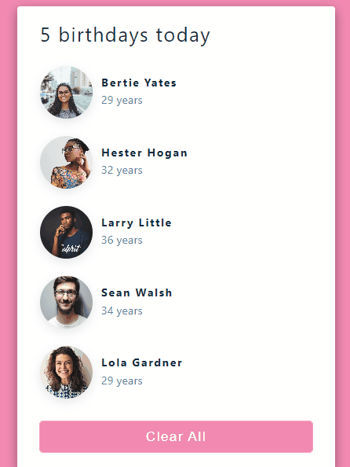</td>
      </tr>
    <tr>
      <td align=center >2.</td>
      <td>Tours</td>
      <td><a href="https://github.com/Tolga-Han-Yilmaz/02-tours" target="_blank">Repo Details</td>
      <td><a href="https://react-02-tour.netlify.app/" target="_blank">App Details</td>
      <td>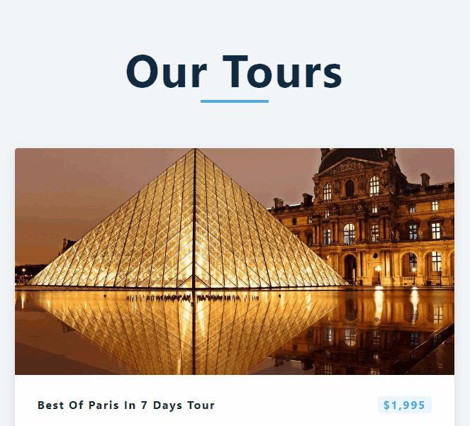</td>
    </tr>
    <tr>
      <td align=center >3.</td>
      <td>Reviews</td>
      <td><a href="https://github.com/Tolga-Han-Yilmaz/03-reviews/tree/master" target="_blank">Repo Details</td>
      <td><a href="https://react-03-review.netlify.app/" target="_blank">App Details</td>
      <td>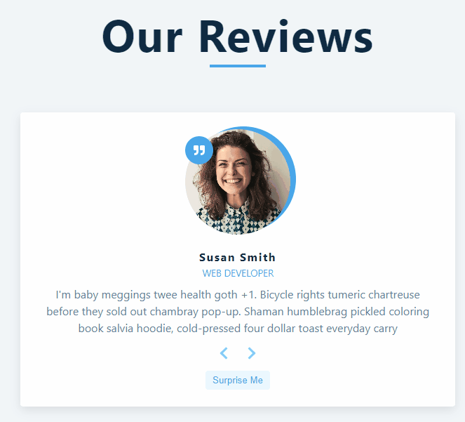</td>
    </tr>
    <tr>
      <td align=center >4.</td>
      <td>Accordion</td>
      <td><a href="https://github.com/Tolga-Han-Yilmaz/04-accordion" target="_blank">Repo Details</td>
      <td><a href="https://starlit-sfogliatella-61b26e.netlify.app/" target="_blank">App Details</td>
      <td>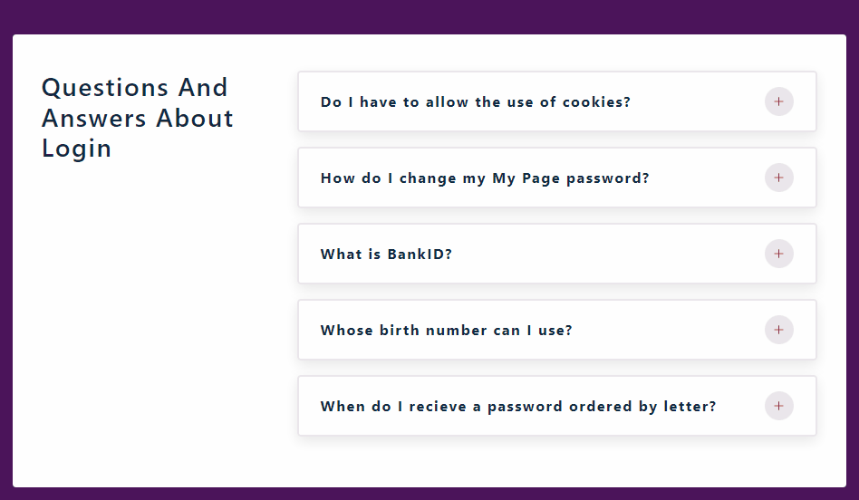</td>
    </tr>
    <tr>
      <td align=center >5.</td>
      <td>Menu</td>
      <td><a href="https://github.com/Tolga-Han-Yilmaz/05-menu" target="_blank">Repo Details</td>
      <td><a href="https://jazzy-kataifi-96fe6f.netlify.app/" target="_blank">App Details</td>
      <td>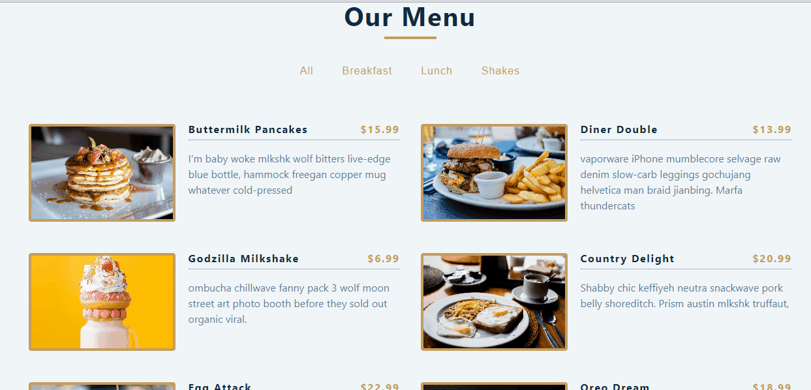</td>
    </tr>
    <tr>
      <td align=center >6.</td>
      <td>Tabs</td>
      <td><a href="https://github.com/Tolga-Han-Yilmaz/06-tabs" target="_blank">Repo Details</td>
      <td><a href="https://strong-nasturtium-a15b9c.netlify.app/" target="_blank">App Details</td>
      <td>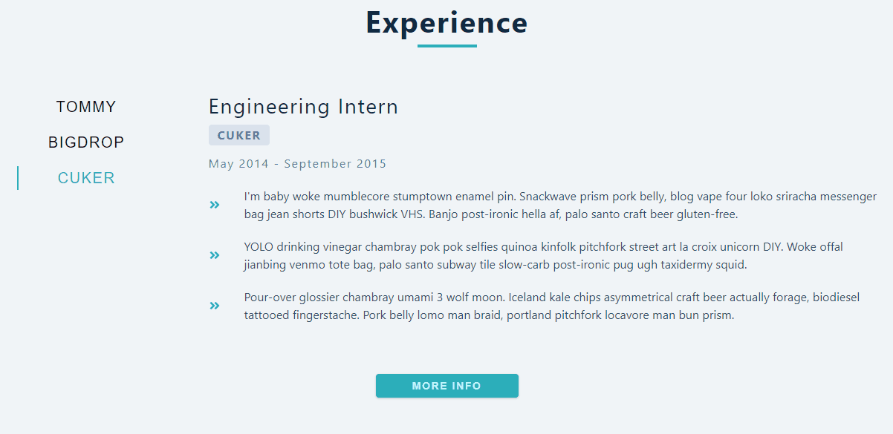</td>
    </tr>
    <tr>
      <td align=center >7.</td>
      <td>Tour Places</td>
      <td><a href="https://github.com/Tolga-Han-Yilmaz/tour-places" target="_blank">Repo Details</td>
      <td><a href="https://vermillion-eclair-35e0db.netlify.app/" target="_blank">App Details</td>
      <td></td>
    </tr>
    <tr>
      <td align=center >8.</td>
      <td>Language Cards</td>
      <td><a href="https://github.com/Tolga-Han-Yilmaz/language_cards" target="_blank">Repo Details</td>
      <td><a href="https://statuesque-daffodil-da608f.netlify.app/" target="_blank">App Details</td>
      <td>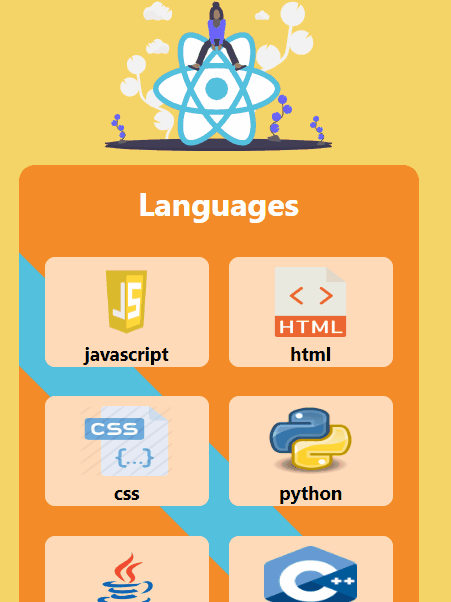</td>
    </tr>
    <tr>
      <td align=center >9.</td>
      <td>Task Trackers</td>
      <td><a href="https://github.com/Tolga-Han-Yilmaz/task_tracker" target="_blank">Repo Details</td>
      <td><a href="https://react-task-tracker01.netlify.app/" target="_blank">App Details</td>
      <td>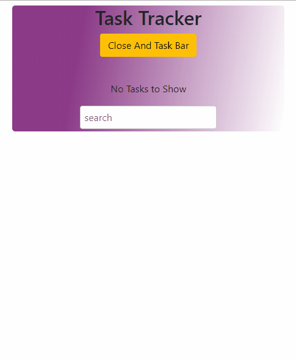</td>
    </tr>
    <tr>
      <td align=center >10.</td>
      <td>Random User App</td>
      <td><a href="https://github.com/Tolga-Han-Yilmaz/random_user_app" target="_blank">Repo Details</td>
      <td><a href="https://react-random-userapp.netlify.app/" target="_blank">App Details</td>
      <td>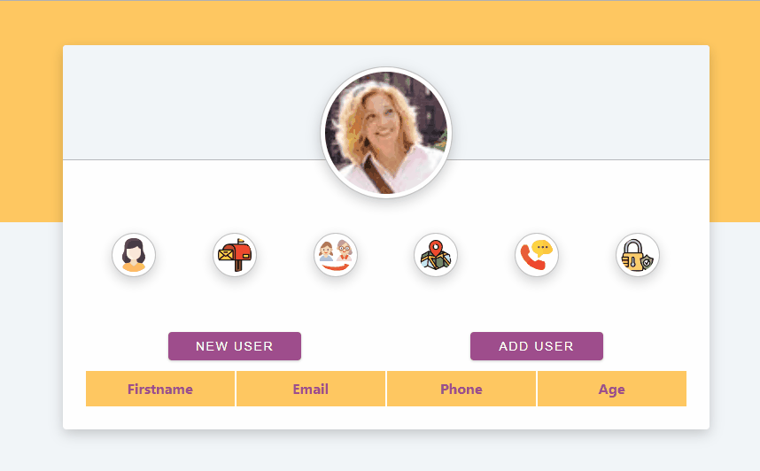</td>
    </tr>
    <tr>
      <td align=center >11.</td>
      <td>Axios Crud</td>
      <td><a href="https://github.com/Tolga-Han-Yilmaz/axios-crud" target="_blank">Repo Details</td>
      <td><a href="https://bejewelled-meerkat-a5d728.netlify.app/" target="_blank">App Details</td>
      <td></td>
    </tr>
    <tr>
      <td align=center >12.</td>
      <td>React Styled</td>
      <td><a href="https://github.com/Tolga-Han-Yilmaz/react_styled-project" target="_blank">Repo Details</td>
      <td><a href="https://celebrated-fudge-9a9393.netlify.app/" target="_blank">App Details</td>
      <td></td>
    </tr>
    <tr>
      <td align=center >13.</td>
      <td>Recipe App</td>
      <td><a href="https://github.com/Tolga-Han-Yilmaz/recipe_app" target="_blank">Repo Details</td>
      <td><a href="https://recipe-app01.netlify.app/" target="_blank">App Details</td>
      <td></td>
    </tr>
    <tr>
      <td align=center >14.</td>
      <td>Movie App</td>
      <td><a href="https://github.com/Tolga-Han-Yilmaz/movie_app" target="_blank">Repo Details</td>
      <td><a href="https://movies-app2022.netlify.app/" target="_blank">App Details</td>
      <td></td>
    </tr>
    <tr>
      <td align=center >15.</td>
      <td>Firecontact App</td>
      <td><a href="https://github.com/Tolga-Han-Yilmaz/firecontact_app" target="_blank">Repo Details</td>
      <td><a href="https://firecontacts.netlify.app/" target="_blank">App Details</td>
      <td>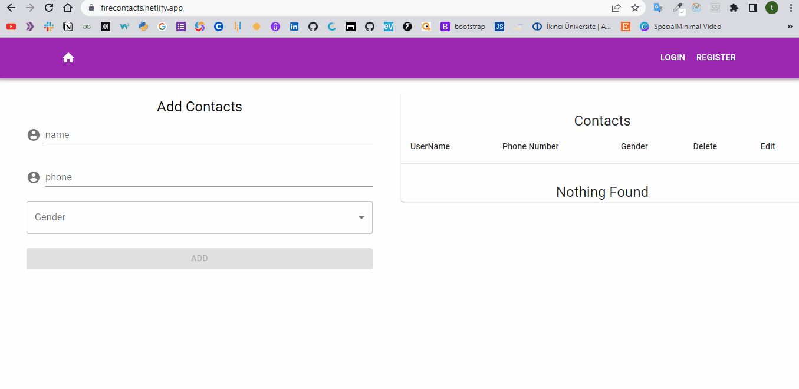</td>
    </tr>
    <tr>
      <td align=center >16.</td>
      <td>Countries App</td>
      <td><a href="https://github.com/Tolga-Han-Yilmaz/countries_app" target="_blank">Repo Details</td>
      <td><a href="https://countriesapp2022.netlify.app/" target="_blank">App Details</td>
      <td>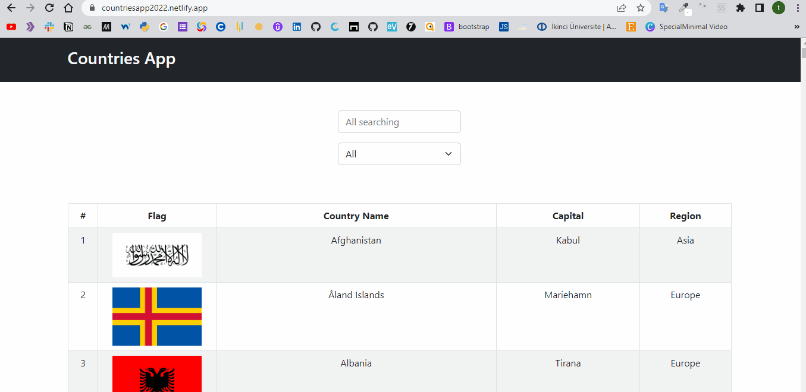</td>
    </tr>
    <tr>
      <td align=center >17.</td>
      <td>E-Commerce App</td>
      <td><a href="https://github.com/Tolga-Han-Yilmaz/e-commerce" target="_blank">Repo Details</td>
      <td><a href="https://e-commerce-ivory-six.vercel.app/" target="_blank">App Details</td>
      <td></td>
    </tr>
    <tr>
      <td align=center >18.</td>
      <td>THY Blog App</td>
      <td><a href="https://github.com/Tolga-Han-Yilmaz/social-media" target="_blank">Repo Details</td>
      <td><a href="https://thy-blog.netlify.app/" target="_blank">App Details</td>
      <td></td>
    </tr>
    <tr>
      <td align=center >19.</td>
      <td>E Course</td>
      <td><a href="https://github.com/Tolga-Han-Yilmaz/global_ai_hub" target="_blank">Repo Details</td>
      <td><a href="https://global-ai-hub-courses-rho.vercel.app/" target="_blank">App Details</td>
      <td>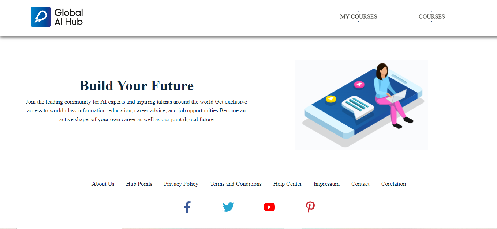</td>
    </tr>
    <tr>
      <td align=center >20.</td>
      <td>Myportfolio</td>
      <td><a href="https://github.com/Tolga-Han-Yilmaz/myportfolio" target="_blank">Repo Details</td>
      <td><a href="https://tolgahanyilmaz.vercel.app/" target="_blank">App Details</td>
      <td>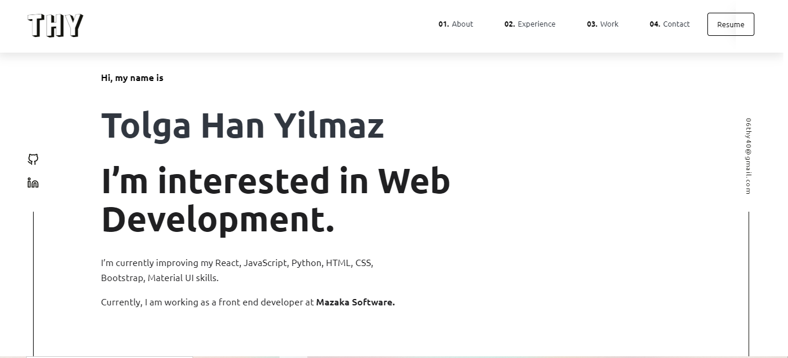</td>
    </tr>
    
  
   
  <tbody>

</table>
